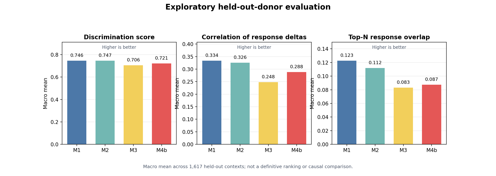
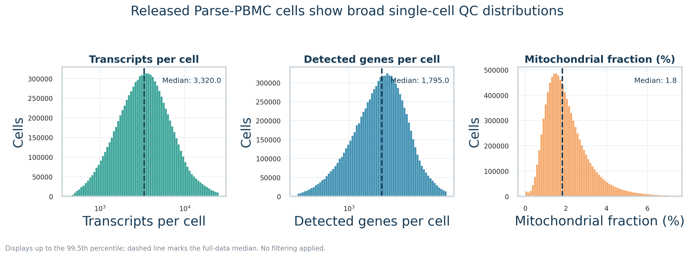

# STATE and Parse-PBMC retrospective

This private portfolio record documents an exploratory AI virtual-cell project: predicting cytokine-induced transcriptomic responses in a large public human PBMC dataset with STATE.

## Question

Can a set-based perturbation model learn cytokine response patterns while generalizing to donors not seen during training? The work focused on scalable data preparation, strict donor-zero-shot experimental design, exploratory configuration comparisons, prediction evaluation, descriptive quality control, and readiness planning for future independent validation.

## Dataset and model context

The Parse-PBMC release used here contains approximately 9.7 million released PBMCs from 12 healthy donors, 90 cytokines plus a PBS control, 24-hour exposure, and 18 annotated cell types. STATE is a publicly available, noncommercial virtual-cell framework that models perturbational responses; this package documents project-specific orchestration and analysis rather than redistributing STATE code.

## My contributions

- Metadata-first inspection and scalable feature/split preparation for a very large H5AD release.
- A donor-aware train/validation/test design that held out donors rather than individual cells.
- Configuration auditing, split validation, aggregate evaluation, and output review for four exploratory variants. The original training and prediction launch scripts are intentionally omitted because they contain operational details outside this package’s scope.
- Aggregate metric analysis, provenance review, and explicit interpretation limits.
- Read-only Parse-PBMC QC and independent-dataset validation-readiness assessment.

## High-level findings

All four variants produced structurally complete held-out-donor prediction and Cell-Eval outputs. Aggregate metrics differed across variants, but they are exploratory engineering evidence rather than definitive benchmarking. The Parse QC work showed broad released-data coverage and made threshold sensitivity visible without imposing a new QC threshold. Independent-dataset work established readiness evidence, not completed external validation.

One configuration-history correction materially limits interpretation of the variant comparison; see [limitations](docs/limitations.md) and [provenance](docs/provenance.md).

*Aggregate held-out-donor metrics are exploratory evidence, not a causal or definitive model ranking.*

*Read-only QC distributions summarize the released dataset and do not define new filtering thresholds.*

## Repository map

- `docs/`: project narrative, methods, results boundaries, provenance, and reproducibility notes.
- `configs/`: a human-readable description of the four exploratory variants.
- `scripts/`: sanitized project-specific utilities, not a turnkey pipeline.
- `results/`: aggregate metrics and selected standalone figures only.

## Data and dependencies

No source data, model weights, cell-level predictions, or third-party datasets are included. Data and dependencies must be obtained from their original providers.

See the Parse Biosciences PBMC dataset page and the STATE paper/repository listed in [third-party notices](THIRD_PARTY_NOTICES.md). This unlicensed private record is not a distribution package.
